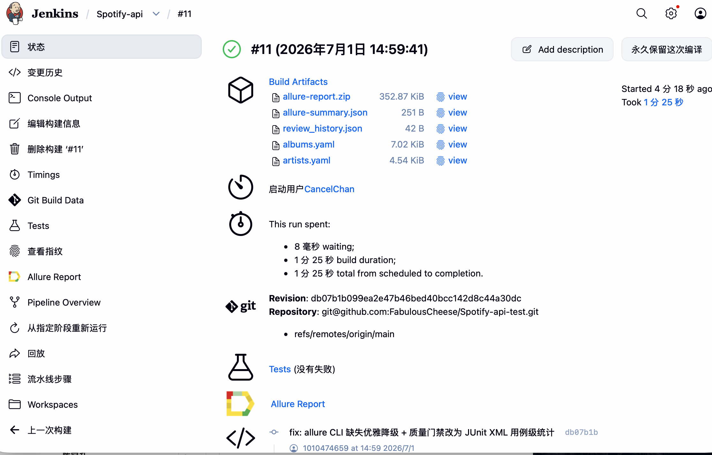
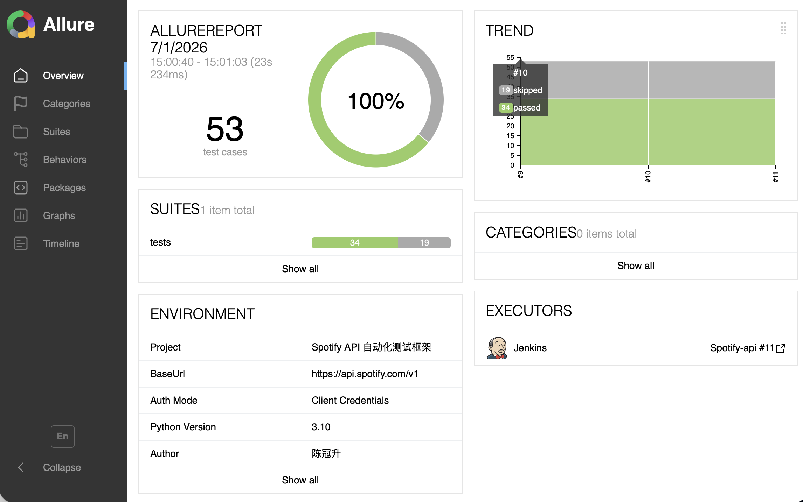

# Spotify API 自动化测试框架

基于 **OpenAPI 规范 + LLM (DeepSeek)** 的接口自动化测试框架。从 7500+ 行 YAML 规范自动生成 pytest 测试用例，支持纯数据驱动与有状态链路两种模式。

## 核心亮点

- **LLM 驱动的测试生成** — 从 OpenAPI 规范自动分类端点、生成 YAML 测试数据和 pytest 代码，减少 80% 手工编写
- **双角色交叉审查** — 同一 LLM 以「生成者」与「独立审计师」两种角色运行，审计师用不同 prompt 批判性审查生成质量，避免"自己审自己"的盲区
- **端点覆盖率追踪** — 对比 OpenAPI 全部端点 vs 已生成用例，自动计算覆盖率并输出未覆盖端点清单
- **数据驱动架构** — YAML 定义用例，通用框架永不该；新增用例只需编辑 YAML，零代码改动
- **$ref 递归解析引擎** — 自研 OpenAPI 规范解析器，支持 3 层深度递归展开，LLM 可直接理解
- **LLM 自审查闭环** — 执行 → 失败 → LLM 诊断 → 自动修复 YAML，直至通过率达标
- **多层测试报告** — Allure HTML 可视化报告（含请求/响应附件 + 趋势历史）+ JUnit XML + JSON 流水线报告
- **框架自测覆盖** — 核心模块有独立单元测试，mypy 类型检查零错误

## 架构

```
open-api-schema.yaml  (Spotify OpenAPI 3.0, 70+ 端点)
        │
        ▼
   src/extractor.py    ─── 解析 → $ref 展开 → 按 tag 分组去重
        │
        ▼
   src/classifier.py   ─── LLM 分类 → data_driven / need_code
        │
        ├──────────────────────┐
        ▼                      ▼
src/yaml_generator.py   src/test_generator.py
(生成 YAML 测试数据)    (生成链路测试代码)
        │                      │
        ├──────────────────────┤
        │                      │
        ▼                      ▼
   src/auditor.py       ─── 双角色交叉审查（独立审计师）
        │
        ▼
   src/coverage.py      ─── 端点覆盖率统计
        │
        ├──────────────────────┐
        ▼                      ▼
test_data_driven.py     test_stateful_workflows.py
(通用框架，永不该)       (SETUP→ACTION→VERIFY→CLEANUP)
        │                      │
        └──────────┬───────────┘
                   ▼
          src/pipeline.py  ─── 编排执行 + 多层报告
                   │
         ┌────────┼────────┐
         ▼        ▼        ▼
    JUnit XML  Allure    JSON
               HTML      报告
                   │
                   ▼
          Jenkins / GitHub Actions
```

## 快速开始

### 安装

```bash
python3 -m venv venv
source venv/bin/activate
pip install -r requirements.txt
```

### 配置 `.env`

```bash
cp .env.example .env
# 编辑 .env，填入你的 Spotify 和 DeepSeek 凭据
```

```ini
ClientId=your_client_id
Secret=your_client_secret
LLM_API_KEY=sk-your-key-here
LLM_API_BASE=https://api.deepseek.com
LLM_MODEL=deepseek-v4-pro
```

### 一行跑通

```bash
# 快速模式：只执行已有测试，不调用 LLM
python cli.py run --fast

# 完整流水线：提取→分类→生成→执行
python cli.py pipeline
```

---

## CLI 命令

```
python cli.py extract              # 从 OpenAPI 规范提取端点
python cli.py classify             # LLM 分类端点 (data_driven / need_code)
python cli.py generate --mode data-driven   # 生成 YAML 测试数据
python cli.py generate --mode stateful      # 生成有状态链路测试
python cli.py audit                # 双角色交叉审计（独立审计师）
python cli.py fix                   # 根据审计报告自动修复 🤖 类问题
python cli.py fix --dry-run         # 预览修复内容，不实际修改
python cli.py coverage             # 端点覆盖率统计
python cli.py run --fast           # 快速执行已有测试
python cli.py run --skip-llm       # 跳过 LLM 生成
python cli.py run --dry-run        # 只收集用例不执行
python cli.py review               # LLM 专家审查 & 自动修复
python cli.py report               # 生成 Allure HTML 报告并打开
python cli.py pipeline             # 完整流水线
```

### 高级选项

```bash
# 单接口调试
python cli.py generate --single "/albums/{id}"

# 自定义目标 tag
python cli.py extract --tags "Albums,Tracks,Playlists"

# 详细日志
python cli.py run --fast -v
```

### Makefile

```bash
make all       # 完整流水线
make fast      # 快速测试
make unit      # 框架自测
make typecheck # mypy 类型检查
make audit     # 双角色交叉审计
make fix       # 根据审计报告自动修复 🤖 类问题
make fix-dry   # 预览修复内容，不实际修改
make coverage  # 端点覆盖率统计
make allure-serve  # 生成并打开 Allure 报告
make report    # 生成 Allure HTML 报告
make clean     # 清理
```

---

## 项目结构

```
├── cli.py                          # 统一 CLI 入口 (argparse 子命令)
├── src/                            # 核心包
│   ├── config.py                   # 集中配置管理 (dataclass + 单例)
│   ├── logger.py                   # 统一日志系统
│   ├── llm_client.py               # LLM 调用封装 (自动重试)
│   ├── ref_resolver.py             # OpenAPI $ref 递归解析引擎
│   ├── extractor.py                # 端点提取器
│   ├── classifier.py               # LLM 端点分类器
│   ├── yaml_generator.py           # YAML 测试数据生成器
│   ├── test_generator.py           # pytest 代码生成器
│   ├── reviewer.py                 # LLM 测试审查专家（事后修复）
│   ├── auditor.py                  # 双角色交叉审计师（事前审查）
│   ├── coverage.py                 # 端点覆盖率统计
│   └── pipeline.py                 # 流水线编排器
│
├── tests/
│   ├── conftest.py                 # 公共 fixture (token 管理)
│   ├── test_data_driven.py         # ★ 通用 YAML 驱动框架 (永不该)
│   ├── test_stateful_workflows.py  # 有状态链路测试 (LLM 生成)
│   └── unit/                       # ★ 框架自测 (27 个用例)
│       ├── test_ref_resolver.py
│       ├── test_config.py
│       └── test_extractor.py
│
├── test_data/                      # YAML 测试数据 (只改这里加用例)
├── prompts/                        # LLM Prompt 存档 (调试用)
├── reports/                        # 测试报告 (Allure HTML + JUnit XML + JSON)
├── environment.xml                 # Allure 环境信息
├── open-api-schema.yaml            # Spotify OpenAPI 3.0 规范
├── Makefile
├── Jenkinsfile
├── pyproject.toml
└── .env.example
```

## 添加新测试用例

**数据驱动端点** — 编辑 YAML，代码不动：

```yaml
# test_data/albums.yaml
- name: test_boundary_id_length
  description: 边界：超长ID
  path_params:
    id: "a" * 500
  query_params: {}
  expect:
    status: [400, 403, 404]
```

**有状态端点** — 重新让 LLM 生成：

```bash
python cli.py generate --mode stateful
```

---

## 质量保障工作流

框架采用「事前审查 + 定向修复 + 事后复盘」三层质量机制：

```bash
# 1. 审计 (事前) — 生成后立即交叉审查
python cli.py audit

# 2. 修复 — 自动修可修复的、人工审不可修的
python cli.py fix --dry-run   # 预览 diff
python cli.py fix             # 执行修复（自动备份 .bak）

# 3. 自审查 (事后) — 执行失败后 LLM 诊断 + 自动修复 YAML
python cli.py review
```

审计报告中的问题分为两类：
- `🤖` auto_fixable — 字段缺失、ID 去重等可自动修复
- `👤` 需人工 — 状态码范围过宽、缺异常用例等需人判断

---

## 核心设计决策

| 决策 | 说明 |
|------|------|
| **$ref 递归展开** | 3 层深度递归解析引擎，LLM 无法理解引用，必须预展开 |
| **废弃端点处理** | `deprecated: true` 只生成 2 个冒烟用例，不浪费资源 |
| **状态码保守断言** | 异常场景用 `[400, 403, 404]` 数组，适配不同 API 实现 |
| **YAML 永不该** | `test_data_driven.py` 通过 `glob + parametrize` 实现零代码新增 |
| **清理保证** | 有状态测试用 `try/finally` 确保异常时也执行 cleanup |
| **LLM 自审查** | 测试失败 → LLM 诊断 → 自动修复 YAML → 重新执行，循环至达 80% |
| **双角色交叉审查** | 同一 LLM 以不同 prompt 扮演审计师，在生成后审查质量（事前） + 执行失败后修复（事后） |
| **LLM 调用重试** | 指数退避 + 最多 3 次重试，应对 API 限流和波动 |
| **多层报告** | JUnit XML（CI 集成）+ Allure HTML（可视化）+ JSON（流水线汇总），environment.xml 自动注入 |

## 技术栈

| 组件 | 用途 |
|------|------|
| Python 3.10+ | 主语言 |
| pytest + requests | 测试框架 |
| PyYAML | OpenAPI / YAML 解析 |
| DeepSeek API (OpenAI 兼容) | LLM 测试生成与审查 |
| tenacity | LLM API 调用重试 |
| JUnit XML | Jenkins 集成 |
| Allure (pytest + CLI) | 可视化测试报告 + 趋势历史 |
| mypy | 静态类型检查 |

## CI/CD 流水线

Jenkins Pipeline 6 阶段全自动化，含质量门禁（通过率 ≥ 80%）：



### 配置步骤

1. **添加凭据**：Jenkins Credentials → `deepseek-api-key`、`spotify-client-id`、`spotify-client-secret`
2. **创建 Pipeline Job**：指向仓库 + `Jenkinsfile`（建议用 SSH URL 避免 HTTPS 超时）
3. **构建**：自动解析 `reports/junit*.xml` 生成趋势图，Allure Plugin 自动生成 HTML 报告

流水线阶段：环境准备 → 提取 & 分类 → LLM 生成 → 框架自测 → LLM 审查 → 执行测试 → 质量门禁

## 测试报告

Allure 可视化报告，含请求/响应附件、通过率趋势：


